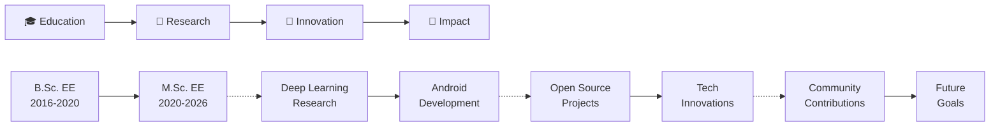

<div align="center">

# 🌟 Welcome to Dávid's Digital Universe 🌟


<br/>

```
     ___           ___           ___                       ___     
    /\  \         /\  \         /\__\          ___        /\  \    
   /::\  \       /::\  \       /:/  /         /\  \      /::\  \   
  /:/\:\  \     /:/\:\  \     /:/  /          \:\  \    /:/\:\  \  
 /:/  \:\__\   /::\~\:\  \   /:/__/  ___      /::\__\  /:/  \:\__\ 
/:/__/ \:|__| /:/\:\ \:\__\  |:|  | /\__\  __/:/\/__/ /:/__/ \:|__|
\:\  \ /:/  / \/__\:\/:/  /  |:|  |/:/  / /\/:/  /    \:\  \ /:/  /
 \:\  /:/  /       \::/  /   |:|__/:/  /  \::/__/      \:\  /:/  / 
  \:\/:/  /        /:/  /     \::::/__/    \:\__\       \:\/:/  /  
   \::/__/        /:/  /       ~~~~         \/__/        \::/__/   
    ~~            \/__/                                   ~~       
```

[](https://www.linkedin.com/in/babos-d%C3%A1vid-ba9bb5227/)
[](https://github.com/FokaKefir)
[](https://buymeacoffee.com/babosdavid8)

</div>

---

## 🎮 About Me - Player Stats

```yaml
name: Dávid Babos
class: Electrical Engineer
level: 26
location: Budapest, Hungary 🇭🇺
guild: Budapest University of Technology and Economics
main_stats:
  intelligence: 85
  creativity: 90
  problem_solving: 92
  coffee_addiction: 99
special_abilities:
  - Android Development Mastery
  - Deep Learning Sorcery
  - Embedded Systems Wizardry
  - Multilingual Communication (HU/EN/DE)
current_quest: Master's Thesis in AI Systems
alignment: Chaotic Good
motto: "Turning caffeine into code since 2020"
```

---

## 🎯 Skill Tree

<div align="center">

### 🌳 Main Branches

<table>
<tr>
<td width="50%" valign="top">

#### 📱 Mobile Development Branch
- ✅ **Kotlin** - Level: Expert
- ✅ **Android SDK** - Level: Advanced
- ✅ **Java** - Level: Proficient
- ✅ **XML Layouts** - Level: Advanced
- ✅ **Jetpack Compose** - Level: Learning
- 🔄 **Material Design** - Level: Advanced

#### 🧠 AI/ML Branch
- ✅ **Python** - Level: Expert
- ✅ **TensorFlow** - Level: Advanced
- ✅ **PyTorch** - Level: Intermediate
- ✅ **Neural Networks** - Level: Advanced
- ✅ **Computer Vision** - Level: Advanced
- 🔄 **NLP** - Level: Learning

</td>
<td width="50%" valign="top">

#### ⚡ Embedded Systems Branch
- ✅ **C/C++** - Level: Advanced
- ✅ **Arduino** - Level: Expert
- ✅ **Raspberry Pi** - Level: Advanced
- ✅ **Circuit Design** - Level: Advanced
- ✅ **IoT** - Level: Intermediate
- 🔄 **RTOS** - Level: Learning

#### 🛠️ Tools & Utilities Branch
- ✅ **Git/GitHub** - Level: Advanced
- ✅ **Linux** - Level: Intermediate
- ✅ **VS Code** - Level: Expert
- ✅ **Android Studio** - Level: Expert
- ✅ **Jupyter** - Level: Advanced
- ✅ **Docker** - Level: Beginner

</td>
</tr>
</table>

</div>

---

## 📊 Battle Statistics

<div align="center">


</div>

---

## 🏆 Quest Log - Featured Projects

<div align="center">

| 🎯 Quest Name | ⚔️ Difficulty | 🛡️ Tech Stack | 📜 Status |
|--------------|--------------|---------------|----------|
| **🤖 AI Home Assistant** | ⭐⭐⭐⭐⭐ | Android, Kotlin, TensorFlow, IoT | 🟢 Active |
| **🧠 Neural Network Lab** | ⭐⭐⭐⭐ | Python, PyTorch, Matplotlib | 🟢 Active |
| **📱 Health Tracker Pro** | ⭐⭐⭐ | Kotlin, Room, MVVM | ✅ Completed |
| **⚡ Smart IoT Gateway** | ⭐⭐⭐⭐⭐ | C++, Raspberry Pi, MQTT | 🟡 In Progress |
| **🎓 Master's Thesis** | ⭐⭐⭐⭐⭐⭐ | Python, TensorFlow, Research | 🟡 In Progress |

</div>

---

## 🎨 Language Distribution

<div align="center">

```text
Kotlin          ████████████████░░░░░  70.5%  📱 Android magic
Python          ████████████░░░░░░░░░  55.3%  🧠 AI & ML wizardry
C/C++           ████████░░░░░░░░░░░░░  38.7%  ⚡ Embedded systems
Java            ██████░░░░░░░░░░░░░░░  29.4%  ☕ Legacy power
XML             ████░░░░░░░░░░░░░░░░░  18.2%  🎨 UI layouts
Other           ██░░░░░░░░░░░░░░░░░░░  12.1%  🔧 Misc tools
```

</div>

---

## 🗺️ Current Adventure Path

<div align="center">



</div>

---

## 🎓 Achievement Unlocked!

<div align="center">

| 🏆 Achievement | 📅 Date | ⭐ Rarity |
|---------------|---------|----------|
| 🎓 **M.Sc. Candidate** | 2020-2026 | Epic |
| 🤖 **Android Developer** | 2021+ | Rare |
| 🧠 **Deep Learning Researcher** | 2022+ | Epic |
| 🌍 **Multilingual Communicator** | Lifelong | Uncommon |
| ☕ **Coffee Connoisseur** | Daily | Common |
| 💻 **Open Source Contributor** | Ongoing | Rare |

</div>

---

## 📚 Learning Path

<div align="center">

### 🔥 Currently Grinding

```kotlin
val currentlyLearning = listOf(
    "🎨 Jetpack Compose" to "Building modern Android UIs",
    "🤖 Transformer Models" to "Advanced NLP techniques",
    "🏗️ Clean Architecture" to "Scalable app design",
    "🔐 Cybersecurity" to "Secure coding practices",
    "☁️ Cloud Services" to "AWS & Firebase integration"
)

currentlyLearning.forEach { (tech, purpose) ->
    println("📖 Learning $tech for $purpose")
}
```

</div>

---

## 💬 Random Dev Wisdom

<div align="center">


</div>

---

## 🌐 Find Me Across The Web

<div align="center">

[](https://www.linkedin.com/in/babos-d%C3%A1vid-ba9bb5227/)
[](https://github.com/FokaKefir)
[](mailto:your.email@example.com)
[](#)

</div>

---

## ☕ Fuel My Code

<div align="center">

**If you like my work, consider supporting me with a coffee!**

<a href="https://buymeacoffee.com/babosdavid8" target="_blank">
  
</a>

*Every coffee helps me stay awake and code more awesome projects! ☕💻*

</div>

---

<div align="center">

### 📈 Profile Views


### 🎮 Game Over?

**Never! The adventure continues...**

```
╔════════════════════════════════════════════╗
║  Thanks for visiting my profile!           ║
║  Feel free to star ⭐ my repositories      ║
║  and let's build something amazing! 🚀     ║
╚════════════════════════════════════════════╝
```


</div>
