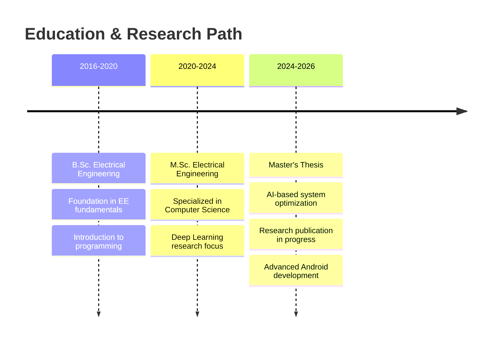

```
███████╗ ██████╗ ██╗  ██╗ █████╗     ██╗  ██╗███████╗███████╗██╗██████╗ 
██╔════╝██╔═══██╗██║ ██╔╝██╔══██╗    ██║ ██╔╝██╔════╝██╔════╝██║██╔══██╗
█████╗  ██║   ██║█████╔╝ ███████║    █████╔╝ █████╗  █████╗  ██║██████╔╝
██╔══╝  ██║   ██║██╔═██╗ ██╔══██║    ██╔═██╗ ██╔══╝  ██╔══╝  ██║██╔══██╗
██║     ╚██████╔╝██║  ██╗██║  ██║    ██║  ██╗███████╗██║     ██║██║  ██║
╚═╝      ╚═════╝ ╚═╝  ╚═╝╚═╝  ╚═╝    ╚═╝  ╚═╝╚══════╝╚═╝     ╚═╝╚═╝  ╚═╝
```

<div align="center">

# 🎯 Dávid Babos | Full-Stack Innovation Engineer


<br/>

[](https://github.com/FokaKefir)
[](https://www.linkedin.com/in/babos-d%C3%A1vid-ba9bb5227/)
[](https://buymeacoffee.com/babosdavid8)

</div>

---

## 📌 TL;DR

> **MSc Electrical Engineering @ Budapest University of Technology and Economics**  
> Bridging the gap between hardware and software · Specializing in Android development & AI research  
> Building intelligent systems that make a difference 🚀

---

## 🧬 Technical DNA

<table>
<tr>
<td width="33%" valign="top">

### 📱 Mobile Engineering
```typescript
const mobile = {
  languages: [
    'Kotlin',
    'Java',
    'XML'
  ],
  frameworks: [
    'Android SDK',
    'Jetpack Compose',
    'Jetpack Libraries'
  ],
  architecture: [
    'MVVM',
    'Clean Architecture',
    'Dependency Injection'
  ],
  experience: '3+ years'
};
```

</td>
<td width="33%" valign="top">

### 🧠 AI & Machine Learning
```python
ai_stack = {
    'languages': ['Python'],
    'frameworks': [
        'TensorFlow',
        'PyTorch',
        'Keras'
    ],
    'specialization': [
        'Deep Learning',
        'Computer Vision',
        'Neural Networks'
    ],
    'experience': '2+ years'
}
```

</td>
<td width="33%" valign="top">

### ⚡ Embedded Systems
```c
struct embedded {
    char* languages[];
    // ["C", "C++"]
    
    char* platforms[];
    // ["Arduino", "Raspberry Pi"]
    
    char* focus[];
    // ["IoT", "Circuit Design"]
    
    int experience_years;
    // 4+
};
```

</td>
</tr>
</table>

---

## 🎯 Tech Stack Visualization

<div align="center">

### 🛠️ Primary Technologies


### 🔧 Tools & Platforms


### 📊 Proficiency Levels

```text
Kotlin          ████████████████████  Expert    │ 95%
Python          ██████████████████░░  Advanced  │ 90%
Android SDK     ████████████████████  Expert    │ 95%
TensorFlow      ████████████████░░░░  Advanced  │ 80%
C/C++           ██████████████░░░░░░  Proficient│ 70%
Arduino         ████████████████████  Expert    │ 95%
Git/GitHub      ██████████████████░░  Advanced  │ 90%
```

</div>

---

## 🚀 Flagship Projects

<div align="center">

<table>
<tr>
<td width="50%">

### 🏠 SmartHome AI Suite
**Advanced home automation with ML integration**

- 🎯 Real-time device control via Android
- 🧠 Predictive behavior learning
- 🔐 Secure local processing
- 📊 Energy optimization algorithms

**Stack:** `Kotlin` `TensorFlow` `Raspberry Pi` `MQTT`

[](#)

</td>
<td width="50%">

### 🧠 DeepVision Analyzer
**Neural network visualization platform**

- 📈 Interactive architecture viewer
- 🎨 Real-time training visualization
- 🔍 Layer-by-layer analysis
- 📊 Performance metrics dashboard

**Stack:** `Python` `TensorFlow` `Matplotlib` `Streamlit`

[](#)

</td>
</tr>
<tr>
<td width="50%">

### 💪 FitFlow Tracker
**Comprehensive fitness & health app**

- 📱 Material You design
- 📊 Advanced statistics
- 🎯 Goal tracking & achievements
- ☁️ Cloud sync capabilities

**Stack:** `Kotlin` `Jetpack Compose` `Room` `Firebase`

[](#)

</td>
<td width="50%">

### ⚡ EdgeAI Detection
**Real-time object detection on embedded devices**

- 🎯 TensorFlow Lite optimization
- ⚡ < 100ms inference time
- 🔋 Power-efficient design
- 📷 Live camera integration

**Stack:** `C++` `TensorFlow Lite` `Arduino` `OpenCV`

[](#)

</td>
</tr>
</table>

</div>

---

## 📈 Performance Metrics

<div align="center">


</div>

---

## 🎓 Academic Journey



---

## 💼 Professional Interests

<div align="center">

| Domain | Interest Level | Focus Areas |
|--------|---------------|-------------|
| 📱 **Mobile Development** | ⭐⭐⭐⭐⭐ | Native Android, Kotlin, Jetpack Compose |
| 🧠 **Artificial Intelligence** | ⭐⭐⭐⭐⭐ | Deep Learning, Computer Vision, NLP |
| ⚡ **Embedded Systems** | ⭐⭐⭐⭐ | IoT, Arduino, Raspberry Pi |
| 🔬 **Research** | ⭐⭐⭐⭐ | ML Optimization, Edge Computing |
| 🌐 **Open Source** | ⭐⭐⭐ | Contributing to community projects |

</div>

---

## 🌱 Currently Growing

```kotlin
data class LearningPath(
    val technology: String,
    val reason: String,
    val progress: Int
)

val currentLearning = listOf(
    LearningPath(
        technology = "Kotlin Multiplatform Mobile (KMM)",
        reason = "Cross-platform code sharing",
        progress = 45
    ),
    LearningPath(
        technology = "Transformer Models & LLMs",
        reason = "Advanced NLP capabilities",
        progress = 60
    ),
    LearningPath(
        technology = "Cloud Architecture (AWS/GCP)",
        reason = "Scalable backend solutions",
        progress = 30
    ),
    LearningPath(
        technology = "Cybersecurity Best Practices",
        reason = "Secure application development",
        progress = 55
    )
)
```

---

## 🏆 Certifications & Achievements

<div align="center">

| 🎖️ Certification | 📅 Year | 🏛️ Provider |
|------------------|---------|-------------|
| 🎓 M.Sc. Electrical Engineering (In Progress) | 2020-2026 | BME |
| 📱 Android Developer | 2021 | Self-taught |
| 🧠 Deep Learning Specialization | 2022 | Coursera |
| 🌐 English C1 Certificate | 2019 | Official |

</div>

---

## 📊 Weekly Development Breakdown

```text
Kotlin          12 hrs 30 mins  ████████████░░░░░░░░░  50%
Python           6 hrs 15 mins  ██████░░░░░░░░░░░░░░░  25%
C++              3 hrs 45 mins  ███░░░░░░░░░░░░░░░░░░  15%
Research         2 hrs 30 mins  ██░░░░░░░░░░░░░░░░░░░  10%
```

---

## 🎨 Featured Work Philosophy

<div align="center">

> ### "Innovation happens at the intersection of disciplines"

**My approach:**
- 🎯 **Problem-First:** Understanding the real-world need before coding
- 🧪 **Research-Driven:** Leveraging latest academic findings
- 🏗️ **Architecture-Focused:** Building scalable, maintainable systems
- 🤝 **Collaboration-Ready:** Open to learning and sharing knowledge

</div>

---

## 🌐 Let's Connect & Collaborate

<div align="center">

### I'm interested in:

🤝 **Collaborations on:**
- Android app development projects
- Deep Learning research initiatives
- IoT & embedded system innovations
- Open source contributions

💬 **Happy to discuss:**
- Mobile architecture patterns
- AI/ML implementation strategies
- Hardware-software integration
- Tech trends & best practices

📧 **Reach out via:**

[](https://www.linkedin.com/in/babos-d%C3%A1vid-ba9bb5227/)
[](mailto:your.email@example.com)
[](https://github.com/FokaKefir)

</div>

---

## ☕ Support My Work

<div align="center">

**Enjoyed my projects? Consider fueling my late-night coding sessions!**

<a href="https://buymeacoffee.com/babosdavid8" target="_blank">
  
</a>

*Every coffee = More awesome code! ☕💻*

</div>

---

## 💭 Random Dev Quote

<div align="center">


</div>

---

<div align="center">

### 📊 Profile Analytics


<br/>

```
╔══════════════════════════════════════════════════════════════╗
║                                                              ║
║  "First, solve the problem. Then, write the code."          ║
║                                    — John Johnson            ║
║                                                              ║
║  Thanks for visiting! Don't forget to star ⭐ interesting   ║
║  repos and let's build the future together! 🚀              ║
║                                                              ║
╚══════════════════════════════════════════════════════════════╝
```

**⚡ Made with 💙 and lots of ☕ by Dávid Babos**

</div>
